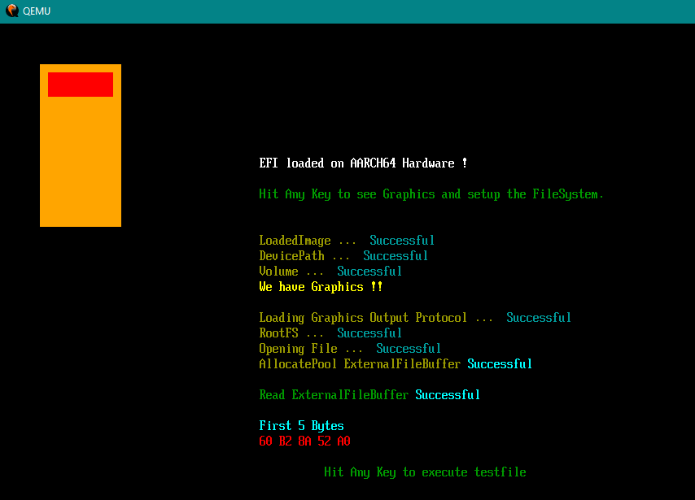
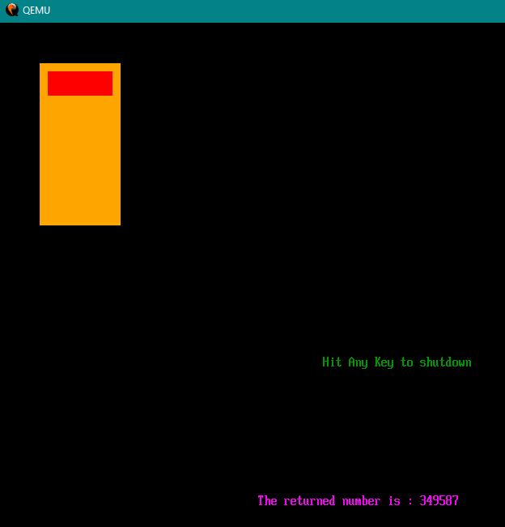

# Demo Code of booting ARM64 (AARCH64) with EFI  
  
*NOTE 1* : This has ONLY been tested in QEMU. Not on real hardware. Yet !  
  
# BIG THANK YOU TO THE FOLLOWING PEOPLE WHO HELPED ME TO MAKE THIS POSSIBLE
	- ANGEL  
	- QUESO  
	- JESTERJUNK  
	- STRYKER  
	- AND ALL OF MY YOUTUBE SUBSCRIBERS  
  
YOUTUBE VIDEO  
https://www.youtube.com/watch?v=lU-saMCMVfw  
  
*NOTE 2* : This code will compile with CLANG on windows. It loads a file, and then executes that loaded file giving a return number. (Scroll down to see the screenshots.) No other dependancies needed. Currently, there is no way to compile this code with GCC. The GCC Team does have it planned this year to allow compiling for ARM64 for windows users. They are just slow about getting it done.  
  
*CLANG*  --  Get the 18.1.5 version  
https://github.com/llvm/llvm-project/releases  
CLANG NOTE :  It's the latest one with the EXE for windows at the time of writing this.  
  
*OSFMount*  -- To mount the drive.hdd file  
https://www.osforensics.com/tools/mount-disk-images.html  
  
*QEMU* -- Has an ARM64(AARCH64) Emulation built in.  
https://www.qemu.org/  
 
*NOTE 3* : Make sure to put the above programs into your windows path.  
  
*BIOS FOR QEMU*   
The included "RELEASEAARCH64_QEMU_EFI.fd" file is like my BIOS64.BIN file in the EFI Youtube videos. These are used for QEMU to load EFI only. No other reason to need these files otherwise. If you ever need to update this file, you can get the QEMU BIOS-like files here. Rename them to BIOS64.BIN if you want, like I did in my original videos. But make sure the BAT file has the correct name.  
https://github.com/retrage/edk2-nightly  
  
EFI-TUTORIALS YOUTUBE PLAYLIST (x86_64 Based)  
https://www.youtube.com/watch?v=hkZUd8norFc&list=PLwH94sFU_ljPi2ClIcWIvuc1GdLT81uuH  
  
YOUTUBE DEMONSTRATION FOR ARM64  
https://www.youtube.com/watch?v=6ogUwvZ-4n4  
  
*NOTE 4* : I do want to make a ARM64 EFI tutorial series, I'm just not sure I can yet.  
  
*NOTE 5* : Although I tested with 1 Gig Ram, I am under the impression ARM64 requires 4 Gigs. So I updated the BAT file to allow 4 Gigs Ram.  
  
*NOTE 6* : QEMU has emulation built in for ARM64, however VirtualBox does NOT. So it will not emulate ARM64 Architecture.  
  
*NOTE 7* : ARM PDF Documentation has been put into the HOLD folder. Grab it while you can. Github complains about it's size.  
  
  
  
  
  